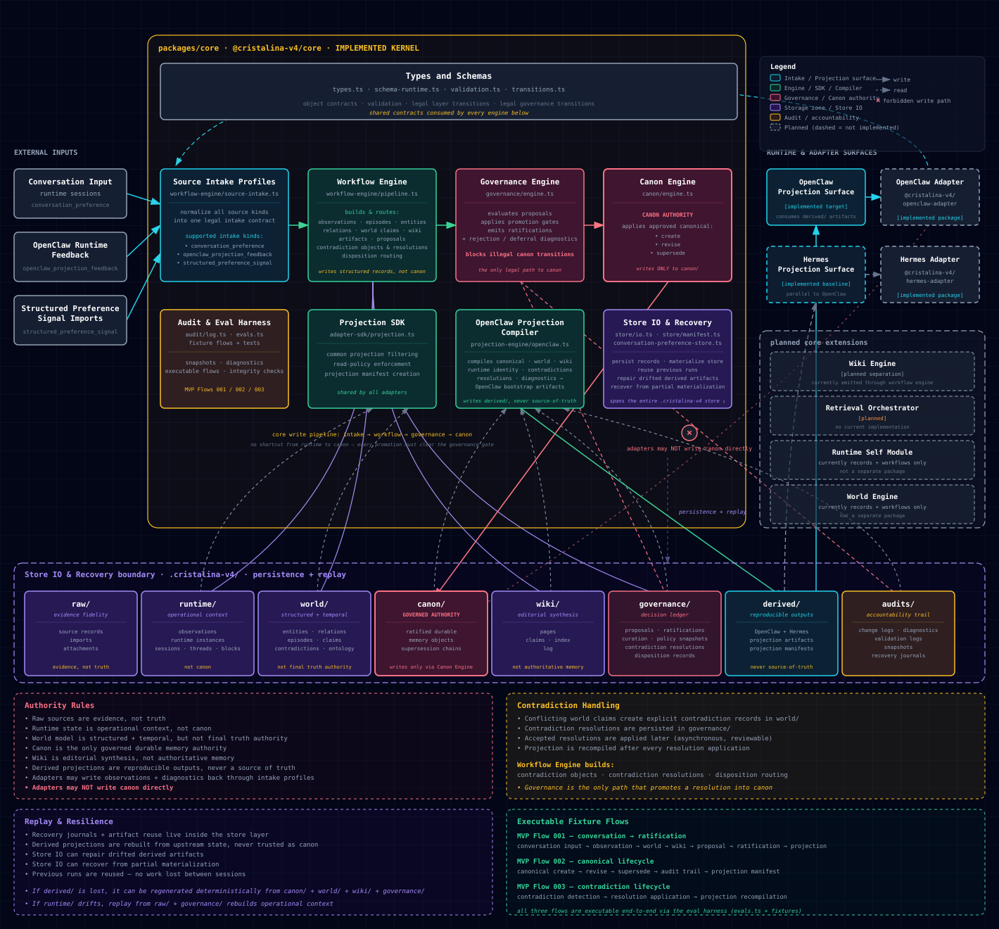

# Cristalina v4

> A runtime-agnostic, governed memory kernel for AI agents.
> Raw sources + runtime self + temporal world model + governed canonical memory + persistent knowledge wiki — with a hard line between **evidence**, **operational state**, and **truth**.

[](LICENSE)
[](PROJECT-STATUS.md)
[](https://pnpm.io/workspaces)
[](https://nodejs.org)
[](https://www.typescriptlang.org/)

---

## Architecture at a glance



> 🔍 **[View the diagram in full detail →](https://glucksberg.github.io/cristalina-v4/)** (live, fully styled, summary cards included)
> Or open [`docs/architecture.html`](docs/architecture.html) locally.

---

## What it is

Cristalina v4 is a **memory kernel** designed to sit underneath any agent runtime (OpenClaw, Hermes, your own) and give that runtime a coherent, replayable, governed memory layer.

It separates memory into six layers, each with explicit authority:

| Layer        | Role                                  | Authority                                    |
|--------------|---------------------------------------|----------------------------------------------|
| `raw/`       | Source records, imports, attachments  | Evidence — never truth                       |
| `runtime/`   | Sessions, observations, threads       | Operational context — never canon            |
| `world/`     | Entities, relations, claims, episodes | Structured + temporal — not final authority  |
| `governance/`| Proposals, ratifications, dispositions| The only legal path into canon               |
| `canon/`     | Ratified durable memory               | **The single source of truth**               |
| `wiki/`      | Editorial synthesis                   | Derived narrative — not authoritative        |
| `derived/`   | Projection artifacts for adapters     | Reproducible outputs — never source of truth |

Adapters consume projections. **Adapters never write canon directly.** Every promotion to canon must pass through the governance gate.

## Why it exists

Most agent memory systems collapse "what was said", "what is known", and "what is true" into the same store. That works until the agent contradicts itself, until you need to audit a decision, until you need to roll back a bad belief, or until you need to migrate to a different runtime.

Cristalina v4 keeps those concerns separate at the architectural level, with executable contracts you can replay. The goal: memory that is governed, auditable, and runtime-agnostic — without becoming a database engine in disguise.

## Status

**Current phase:** operational foundation for the first runtime bridge. See [PROJECT-STATUS.md](PROJECT-STATUS.md) for a precise rundown of what is and isn't built.

What runs today:
- Source intake profiles (3 normalized intake kinds)
- Workflow engine (observations → world → wiki → proposals → contradictions)
- Governance engine (5 promotion gates)
- Canon engine (create / revise / supersede)
- Projection SDK + OpenClaw and Hermes projection compilers
- Store IO with reuse and recovery
- Audit log, recovery journals, and executable end-to-end fixture flows
- Retrieval, vector, external-candidate, maintenance, and eval boundaries
- Working-memory checkpoints, session packs, and resume receipts
- Minimal authenticated write-through and projection surfaces in the OpenClaw and Hermes adapters
- Dual-runtime smoke flow proving one OpenClaw session and one Hermes session against the same store

What's planned:
- installable `cristalina` CLI and runtime bridge package
- configuration menu in the style of `openclaw config`
- one-line OpenClaw and Hermes installers
- session-pack consumption through the runtime bridge
- operator commands for status, review, diagnostics, projection refresh, and recovery

## Quick start

```bash
# Requires Node >= 20 and pnpm >= 10
git clone https://github.com/Glucksberg/cristalina-v4.git
cd cristalina-v4
pnpm install

pnpm typecheck
pnpm test
pnpm build
pnpm smoke:dual-runtime

# Run an end-to-end fixture (writes a real .cristalina-v4/ store under examples/)
pnpm fixture:mvp-flow-001   # conversation → observation → world → proposal → ratification → projection
pnpm fixture:mvp-flow-002   # canonical create → revise → supersede → audit trail
pnpm fixture:mvp-flow-003   # contradiction detection → resolution → projection recompilation
```

After running a fixture, inspect `examples/mvp-flow-00X/.cristalina-v4/` to see the materialized store layout — every layer, every record, every audit entry.

After running `pnpm smoke:dual-runtime`, inspect `examples/dual-runtime-smoke/.cristalina-v4/smoke-summary.json` for the shared store root, OpenClaw/Hermes projection manifests, stable runtime refs, review action count, and audit/validation log counts.

## Repository layout

```
cristalina-v4/
├── packages/
│   ├── core/                      # @cristalina-v4/core — the governed memory kernel
│   ├── openclaw-adapter/          # projection + write-through boundary for OpenClaw
│   └── hermes-adapter/            # projection + write-through boundary for Hermes
├── docs/                          # architecture, contracts, flows, hardening plan
│   ├── architecture.svg           # diagram embedded above
│   └── architecture.html          # fully styled version with cards
├── schemas/                       # stable object and adapter schemas
├── examples/                      # output of fixture runs
└── notes/                         # rough working notes (lower precision than docs/)
```

## Documentation

The docs are organized by purpose. Start with the first three if you're new.

**Start here**
- [docs/VISION.md](docs/VISION.md) — what Cristalina v4 is and why
- [docs/ARCHITECTURE.md](docs/ARCHITECTURE.md) — the six layers and their relationships
- [docs/NEXT-GEN-MEMORY-SYNTHESIS.md](docs/NEXT-GEN-MEMORY-SYNTHESIS.md) — synthesis of the design

**Contracts**
- [docs/CORE-TYPES.md](docs/CORE-TYPES.md), [docs/OBJECT-ENVELOPE.md](docs/OBJECT-ENVELOPE.md)
- [docs/STORAGE-MODEL.md](docs/STORAGE-MODEL.md), [docs/LEGAL-TRANSITIONS.md](docs/LEGAL-TRANSITIONS.md)
- [docs/RUNTIME-IDENTITY.md](docs/RUNTIME-IDENTITY.md), [docs/DISPOSITION-AND-CONSOLIDATION.md](docs/DISPOSITION-AND-CONSOLIDATION.md)
- [docs/ADAPTER-CONTRACTS.md](docs/ADAPTER-CONTRACTS.md), [docs/SOURCE-INTAKE-PROFILES.md](docs/SOURCE-INTAKE-PROFILES.md)
- [docs/PROJECTION-READ-DISCIPLINE.md](docs/PROJECTION-READ-DISCIPLINE.md), [docs/KNOWLEDGE-WIKI-LAYER.md](docs/KNOWLEDGE-WIKI-LAYER.md)
- [docs/OPERATIONAL-SESSION-MEMORY-RFC-V2.md](docs/OPERATIONAL-SESSION-MEMORY-RFC-V2.md) — continuity contract for checkpoints and derived session packs

**Flows**
- [docs/INFORMATION-FLOW.md](docs/INFORMATION-FLOW.md), [docs/MODULE-FLOWS.md](docs/MODULE-FLOWS.md)
- [docs/MVP-FLOW-001.md](docs/MVP-FLOW-001.md), [docs/MVP-SPEC.md](docs/MVP-SPEC.md)
- [docs/WORLD-CONTRADICTION-FLOW-001.md](docs/WORLD-CONTRADICTION-FLOW-001.md)

**Roadmap & engineering**
- [docs/ROADMAP.md](docs/ROADMAP.md), [docs/HARDENING-PLAN.md](docs/HARDENING-PLAN.md)
- [docs/MODULARIZATION-PLAN.md](docs/MODULARIZATION-PLAN.md), [docs/REUSE-MATRIX.md](docs/REUSE-MATRIX.md)
- [docs/MODEL-DEPENDENCY-MAP.md](docs/MODEL-DEPENDENCY-MAP.md), [docs/NEXT-KERNEL-EXTENSIONS.md](docs/NEXT-KERNEL-EXTENSIONS.md)

**Reference**
- [docs/GLOSSARY.md](docs/GLOSSARY.md), [docs/DECISIONS.md](docs/DECISIONS.md), [docs/NON-GOALS.md](docs/NON-GOALS.md)
- [docs/USE-CASES.md](docs/USE-CASES.md), [docs/EVALS.md](docs/EVALS.md), [docs/FAILURE-MODES.md](docs/FAILURE-MODES.md)
- [docs/INSPIRATION-AND-COMPATIBILITY.md](docs/INSPIRATION-AND-COMPATIBILITY.md), [docs/ANCESTOR-CROSSWALK.md](docs/ANCESTOR-CROSSWALK.md)
- [docs/WSL-DEVELOPMENT.md](docs/WSL-DEVELOPMENT.md)

## Contributing

Contributions welcome — especially around contract clarity, contradiction handling, adapter design, and eval coverage. See [CONTRIBUTING.md](CONTRIBUTING.md).

## License

MIT — see [LICENSE](LICENSE). Use it, fork it, build on it, sell it. The only ask: keep the copyright notice.

---

<sub>Cristalina v4 is in active development. The kernel APIs may change before 1.0. Pin a commit if you depend on it.</sub>
