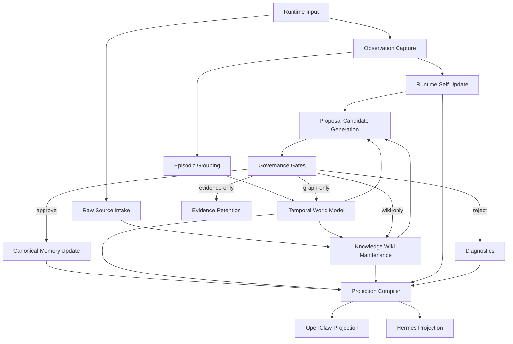

# Cristalina v4
## Information Flow

**Status:** Draft

---

## 1. Why This Document Exists

This repository is being designed partly by reverse engineering older memory systems.

That means the most important task is not writing code fast.

It is preserving the true information logic while discarding accidental legacy structure.

This document makes the target information flow explicit enough to guide implementation.

---

## 2. Core Flow

The target flow is:

1. runtime input occurs
2. source material is normalized into `raw source` records when applicable
3. `observation` is recorded
4. observation updates runtime state
5. observation may be grouped into `episode`
6. episode and observation may update the temporal world model
7. source and world changes may update the knowledge wiki
8. candidate changes may become `proposal`
9. governance evaluates the proposal
10. approved changes update canonical memory
11. canonical memory, world state, wiki state, runtime state, and diagnostics are compiled into runtime projections

This means the system has two different kinds of accumulation:

- **structural accumulation**
  in the temporal world model and canonical memory

- **editorial accumulation**
  in the knowledge wiki

Both are useful.

They are not the same thing.

---

## 3. Read Path

The runtime should read from a compiled projection that may include:

- runtime-self fragments
- world-model fragments
- wiki fragments
- canonical fragments
- diagnostics

The runtime should not need to read canonical storage directly during ordinary operation.

The knowledge wiki exists to make long-lived synthesis cheaper to access.

Instead of re-deriving high-level structure from raw sources every time, the runtime may consult:

- a topic page
- an entity page
- a comparison page
- a synthesis page

These are still derived artifacts.

But they can dramatically reduce rediscovery cost.

---

## 4. Write Path

The runtime may produce:

- observations
- machine-safe structured edits
- freeform edits that only become evidence

The runtime should never write canon directly.

The system should also support a **wiki maintenance path**:

1. new source arrives
2. source summary is generated
3. index is updated
4. relevant wiki pages are revised
5. contradictions or tensions are noted
6. any canonical-worthy claims are emitted as proposals instead of being silently accepted as truth

This is the key rule that keeps the knowledge wiki useful without letting it become an ungoverned shadow canon.

---

## 5. Flow Ownership

| Stage | Output | Owner |
|---|---|---|
| perception | raw input | runtime |
| source normalization | `raw source` | core |
| observation capture | `observation` | core |
| episodic grouping | `episode` | core |
| world update | entities/relations/temporal claims | core |
| wiki maintenance | summaries/pages/index/log | core or dedicated wiki compiler |
| proposal generation | `proposal` | core |
| ratification | canonical changes | core |
| projection | runtime-specific context | adapter |
| diagnostics | bounded feedback | adapter + core |

---

## 6. Reverse-Engineering Rule

When importing logic from older systems, always document it in this order:

1. what information enters
2. what object is created or updated
3. what layer owns that object
4. whether it is provisional, structured, or canonical
5. what the next legal transition is

If this cannot be stated cleanly in natural language, the logic is not ready to be ported.

When importing wiki-style logic specifically, also document:

1. whether the output is editorial or structural
2. whether it is merely summarizing, or asserting a claim
3. whether that claim must emit a proposal candidate

This is necessary because LLM-maintained wikis often blur the line between useful synthesis and authoritative memory.

---

## 7. Flowchart

## 8. Four Persistent Artifacts

The architecture should be understood as maintaining four different persistent artifacts at once:

1. **raw sources**
   - evidence fidelity

2. **temporal world model**
   - structural evolving memory

3. **canonical memory**
   - governed durable truth

4. **knowledge wiki**
   - editorial accumulated synthesis

This is more complete than traditional retrieval systems because the architecture no longer has to choose between:

- searchable raw data
- structured world state
- governed memory
- readable accumulated synthesis

It can have all four, as long as their authority boundaries remain explicit.
