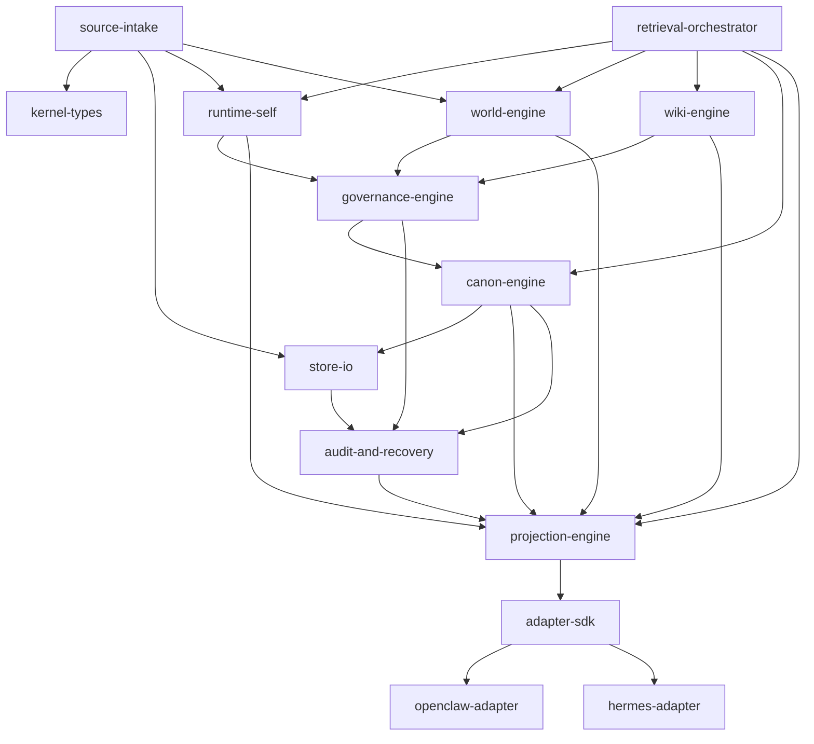
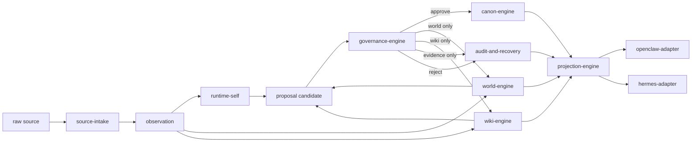
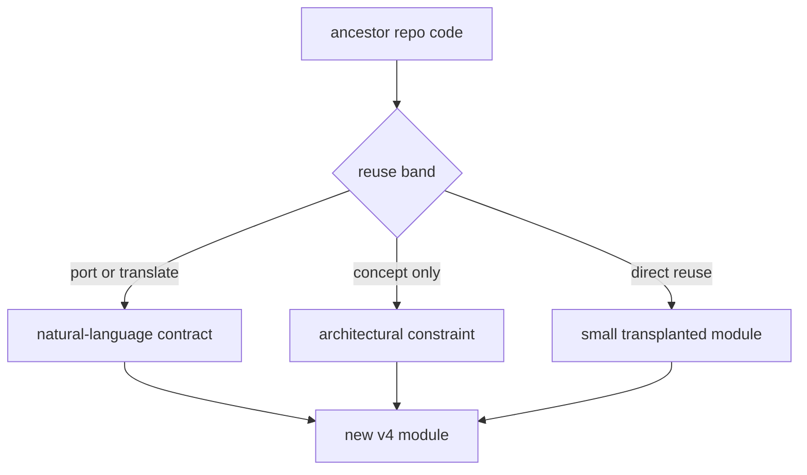
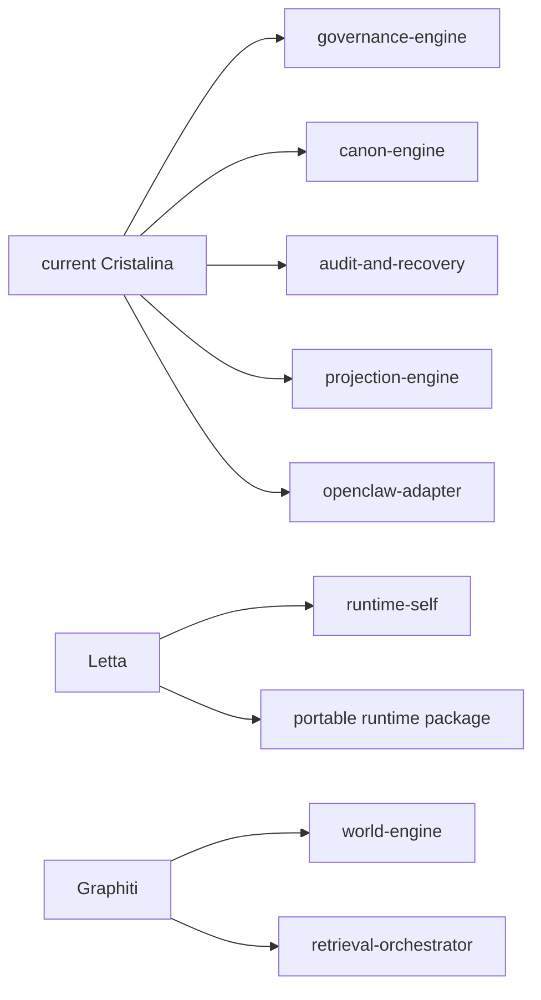

# Cristalina v4
## Module Flows

**Status:** Draft  
**Purpose:** Show how the planned modules interact so implementation can grow on top of a readable systems map

---

## 1. Why This Document Exists

The architecture is already strong enough that it should be visualized in module terms, not only in layer terms.

Layers answer:

- what kind of memory exists

Modules answer:

- which subsystem is responsible for moving and shaping that memory

Both are necessary.

---

## 2. Primary Module Interaction

Interpretation:

- `source-intake` emits evidence and operational observations
- `source-intake` should be profile-driven so new sources extend contracts instead of cloning workflow code
- `runtime-self`, `world-engine`, and `wiki-engine` can all produce governance candidates
- only `governance-engine` can authorize transitions into `canon-engine`
- `projection-engine` assembles outputs for runtimes without turning runtimes into truth owners
- `retrieval-orchestrator` queries across layers but does not own truth
- `audit-and-recovery` watches important transitions and preserves rollback

---

## 3. Information Promotion Flow

This is the key flow that preserves memory law:

- raw evidence does not become canon directly
- wiki does not become canon directly
- world structure does not become canon directly
- runtimes consume projections, not truth ownership

---

## 4. Reuse-Oriented Build Flow

This is the correct way to reuse old code without losing architectural clarity.

The important point is:

- reuse does not happen directly from ancestor repo to final v4 subsystem in every case
- sometimes the right move is to translate old code into contract first

---

## 5. Direct Reuse Concentration

The current expectation is:

This means:

- the current Cristalina contributes the most direct code reuse
- Letta contributes most strongly to runtime-state design
- Graphiti contributes most strongly to temporal world modeling and retrieval orchestration

---

## 6. Module Ownership Rule

Every future module should pass this quick test:

1. Which layer does it primarily serve?
2. Which upstream modules may it trust?
3. Which downstream modules may trust it?
4. Does it create evidence, structure, editorial synthesis, truth, projection, or diagnostics?

If that answer is fuzzy, the module boundary is not ready.
