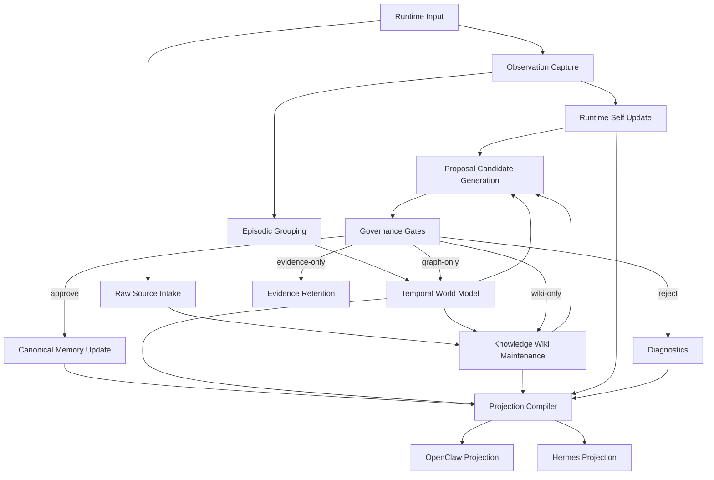

# Next-Gen Memory Synthesis
## A Unified Architecture Beyond Cristalina, Letta, and Zep/Graphiti

**Status:** Exploratory  
**Purpose:** Define a coherent architecture for a more complete persistent agent memory system by selectively inheriting the strengths of Cristalina, Letta, Zep/Graphiti, and the persistent LLM wiki pattern without merging their products directly.

---

## 1. Thesis

The older systems do not merely offer different implementations of the same thing.

They solve different dimensions of the same problem:

- **Letta** optimizes for the continuity of the running agent
- **Zep/Graphiti** optimizes for temporal-relational world memory
- **Cristalina** optimizes for governed canonical memory
- the **LLM Wiki pattern** optimizes for persistent synthesized knowledge that compounds over time

The resulting synthesis should not be a literal codebase merge.

It should be a **new architecture** with:

- a raw source layer
- a runtime self layer
- a temporal world model layer
- a canonical memory layer
- a persistent knowledge wiki layer
- a governance layer that controls promotion across layers

This document treats the older systems as architectural ancestors, not as components to be glued together unchanged.

---

## 2. Foundational Principles

### 2.1 Memory is not one thing

A complete persistent agent memory system must distinguish at least:

- working memory
- episodic memory
- semantic memory
- relational memory
- identity memory
- policy memory
- canonical governed memory
- editorial synthesized knowledge

Any system that collapses these into one retrieval bucket will drift into noise.

### 2.2 Retrieval is downstream of structure

Search quality matters, but retrieval must be a consequence of a well-formed memory architecture rather than the architecture itself.

The new system should be **constitution-first**, not **retrieval-first**.

That said, a constitution-first system should still be ergonomically strong.

A persistent synthesized layer can reduce rediscovery cost dramatically.

The mistake is not having a wiki-like layer.

The mistake is letting the wiki become the hidden source of truth.

### 2.3 Runtime and canon must remain separate

The runtime needs fluidity.

Canonical memory needs law.

The system therefore must preserve a hard separation between:

- what the agent is currently thinking with
- what the system believes about the world
- what has been stabilized as governed memory

### 2.4 Time is a first-class dimension

World facts, relations, beliefs, and priorities change over time.

Temporal validity cannot remain a derived afterthought. It must be attached to the memory model itself.

### 2.5 Governance must survive scale

The system should not depend on perfect prompt discipline forever.

It needs:

- provenance
- confidence
- promotion rules
- supersession
- contradiction tracking
- rollback
- audience and privacy law

These are not secondary features. They are the conditions for trustworthy longitudinal memory.

### 2.6 One claim, one authoritative home

The same claim may appear in more than one projection or retrieval surface.

It must not have more than one authoritative storage home.

That means:

- runtime copies are projections
- graph summaries are structured views
- wiki pages are editorial derived artifacts
- canonical memory is the only durable ratified truth surface

This rule prevents silent divergence between what the agent sees and what the system actually believes.

### 2.7 Memory kind and truth state are different axes

The architecture must not collapse these questions into one field:

- what kind of thing is this
- how certain is the system about it
- how stable is it over time
- whether it is governed or provisional

For example:

- a `belief` may be highly active but not canonical
- a `fact` may be temporally bounded
- a `relation` may be well-supported in the world model but still not ratified into durable canon
- a `wiki_claim` may be editorially valuable but still not be governed truth

If these axes are collapsed too early, the system becomes hard to reason about and impossible to consolidate cleanly.

### 2.8 Compounding knowledge deserves its own layer

One of the strongest patterns in modern LLM knowledge systems is the persistent maintained wiki:

- source summaries
- entity pages
- topic pages
- comparisons
- synthesized notes
- indexes
- logs

This pattern is powerful because it lets knowledge accumulate in human-readable form instead of being rediscovered from raw sources every time.

However, this wiki layer should not be mistaken for:

- the raw source layer
- the temporal world model
- canonical governed memory

It is a different kind of persistence:

- **editorial persistence**

The system should include it deliberately, but constrain its authority explicitly.

---

## 3. Layered Architecture

### 3.1 Raw Source Layer

This layer holds immutable or high-fidelity inputs:

- transcripts
- documents
- notes
- images
- datasets
- clips
- imports

Primary optimization:

- evidence fidelity

This layer should generally be append-only or closely controlled.

It is the deepest evidence layer, not the working knowledge layer.

### 3.2 Runtime Self Layer

This layer holds the active operational mind.

Responsibilities:

- current task focus
- immediate dialog state
- short-horizon plans
- active goals
- recent observations
- pinned self-model and user-model fragments

Primary inheritance:

- **from Letta**: stateful runtime, pinned always-visible memory, working memory discipline

This layer is allowed to be fluid, lossy, and highly adaptive.

It should not be the source of canonical truth.

It may read from wiki fragments, but those fragments must be clearly marked as derived synthesis rather than final truth.

### 3.3 Temporal World Model Layer

This layer stores the structured evolving world.

Responsibilities:

- entities
- relations
- episodes
- places
- projects
- changing facts
- time-bounded truth
- contradictory states awaiting resolution

Primary inheritance:

- **from Zep/Graphiti**: temporal entity graph, relationship-centered memory, evolution of world state over time

This layer is the agent's long-range map of the world.

### 3.4 Canonical Memory Layer

This layer stores what has been stabilized as durable memory.

Responsibilities:

- ratified preferences
- stabilized beliefs
- durable constraints
- values
- identity traits
- trusted project truths
- supersession history

Primary inheritance:

- **from Cristalina**: event/proposal/canonical separation, ratification, provenance, auditability, reversibility

This layer is the system's official memory, not merely its searchable memory.

### 3.5 Governance Layer

This layer controls transitions between the others.

Responsibilities:

- proposal generation
- conflict detection
- approval routing
- privacy and audience checks
- contradiction management
- supersession planning
- policy-based promotion and demotion

Primary inheritance:

- **from Cristalina**, extended with graph-aware promotion logic

This layer is the memory law of the system.

### 3.6 Knowledge Wiki Layer

This layer is a maintained synthesized wiki sitting between raw sources and downstream projections.

Responsibilities:

- source summaries
- entity pages
- concept pages
- topic pages
- comparison pages
- overview pages
- chronological maintenance log
- navigational index

Primary inspiration:

- the LLM-maintained wiki pattern articulated by Andrej Karpathy

This layer should optimize for:

- accumulated synthesis
- cross-linking
- browsing
- maintenance
- explanation

This layer should not be authoritative truth.

Instead, it should act as a durable editorial and navigational surface over the deeper memory system.

### 3.7 Derived Projection Layer

This layer exists only to make the other layers usable by the running agent and by operators.

Responsibilities:

- bootstrap projections
- session packs
- compact operator views
- human-readable summaries
- live diagnostics

This layer owns no truth.

It must be reproducible from upstream memory layers.

### 3.8 Ownership of truth by layer

The architecture becomes easier to implement if ownership is explicit:

| Layer | Owns | Must not own |
|---|---|---|
| Raw Sources | evidence fidelity | derived synthesis or canon |
| Runtime Self | attention, focus, active goals, local working state | durable truth |
| Temporal World Model | structured evolving world state | final canonical truth |
| Canonical Memory | ratified durable truth | transient runtime state |
| Governance | transition rules and approvals | world content itself |
| Knowledge Wiki | editorial synthesis and navigation | authoritative truth |
| Derived Projection | usability and visibility | any authoritative claim |

If two layers appear to own the same memory, the model is wrong and should be refactored.

---

## 4. Unified Data Model

The new system should adopt a single object-native memory model.

Suggested minimal object families:

- `source_record`
- `source_excerpt`
- `observation`
- `episode`
- `entity`
- `relation`
- `fact`
- `belief`
- `preference`
- `constraint`
- `goal`
- `value`
- `identity_trait`
- `proposal`
- `ratification`
- `supersession`
- `contradiction`
- `wiki_page`
- `wiki_link`
- `wiki_revision`
- `wiki_claim`

Suggested mandatory cross-cutting fields:

- `id`
- `kind`
- `status`
- `created_at`
- `updated_at`
- `valid_from`
- `valid_to`
- `confidence`
- `privacy_scope`
- `source_type`
- `source_ref`
- `evidence_refs`
- `actor`
- `governance_state`

Suggested relational fields:

- `subject_ref`
- `object_ref`
- `relation_type`
- `target_ref`
- `supersedes`
- `contradicts`
- `supports`

The key design rule is this:

**all memory layers should speak related object dialects, even if they optimize for different use cases.**

The runtime may use projections, but the underlying memory model should remain compatible across layers.

### 4.1 Separate the major axes explicitly

Every durable memory object should be describable across at least five axes:

1. **memory class**
   - what kind of object this is: `fact`, `belief`, `relation`, `episode`, `value`

2. **epistemic state**
   - how the system knows it: observed, inferred, hypothesized, confirmed, disputed

3. **governance state**
   - where it is in the governance lifecycle: draft, proposed, ratified, superseded, archived

4. **temporal state**
   - when it is believed to apply: active now, bounded interval, historical only, unresolved

5. **visibility state**
   - who may see it: runtime-private, owner-private, shareable, public-safe

This is the minimum dimensionality required to prevent the system from flattening cognition into storage.

### 4.2 Suggested normalized object envelope

The future system should prefer a stable object envelope like:

```yaml
id: mem-...
kind: belief
statement: "The user is currently evaluating memory architecture options."
memory_class: semantic
epistemic_state: inferred
governance_state: proposed
temporal_state:
  valid_from: 2026-04-04T12:00:00Z
  valid_to: null
  temporal_confidence: 0.72
visibility_state:
  privacy_scope: owner_private
provenance:
  source_type: conversation
  source_ref: session/2026-04-04#turn-18
  evidence_refs: [evt-..., evt-...]
relations:
  supports: [prop-...]
  related_entities: [ent-owner]
```

The exact field names may change.

The rule that should not change is this:

**the envelope must preserve kind, truth status, time, governance, and visibility independently.**

### 4.3 Distinguish observations from claims

Not everything the agent records should become a claim.

The model should distinguish:

- `observation`: something was seen, heard, produced, or inferred now
- `claim`: the system asserts something about the world or self
- `memory object`: a claim or structure that has been retained in a managed layer

This distinction is crucial because many systems fail by letting observations harden into memory without a clear transformation step.

### 4.4 Distinguish world truth from canonical truth

The temporal world layer may hold highly useful structured state that is not yet canonical.

So the architecture needs a real distinction between:

- **world-model accepted**
- **canonically ratified**

This is one of the key synthesis points between Zep/Graphiti and Cristalina.

The graph can be operationally useful before something is ready to become durable truth.

### 4.5 Distinguish wiki claims from canonical claims

The architecture should explicitly distinguish:

- a **wiki claim**
  a synthesized statement appearing in an editorial page

- a **canonical claim**
  a durable memory object that passed through governance

Every wiki claim does not need to become canonical.

But every wiki claim that tries to function as durable truth should have a traceable path into:

- proposal generation
- governance review
- or explicit rejection

---

## 5. Memory Processing Pipeline

The target pipeline should look like this:

1. **Perception / interaction**
   - agent observes, reads, acts, or receives input

2. **Raw source intake**
   - register immutable or high-fidelity source artifacts when applicable

3. **Runtime registration**
   - generate `observation` and transient `working state`

4. **Episodic capture**
   - group observations into `episode` candidates

5. **World model update**
   - update entities, relations, temporal facts, and contradictions

6. **Knowledge wiki maintenance**
   - update summaries, pages, links, index, and log

7. **Proposal generation**
   - identify candidates for canonical stabilization from runtime, world, or wiki activity

8. **Governance**
   - score, filter, validate, ask for approval when required

9. **Canonical promotion**
   - create, revise, supersede, archive, or reject

10. **Projection**
   - compile the appropriate runtime views for the active agent

11. **Feedback loop**
   - inform the runtime about ignored edits, failed promotions, unstable assumptions, and outstanding contradictions

This creates a memory system that can be both adaptive and institutionally coherent.

### 5.1 Read path versus write path

The system should explicitly distinguish how information enters memory from how it is later read.

#### Write path

`perception -> raw source/observation -> episode/world/wiki update -> proposal -> governance -> canonical promotion`

#### Read path

`canonical memory + temporal world model + knowledge wiki + runtime state -> projection compiler -> runtime context`

Many memory systems document only the write path.

That is not enough.

The read path determines what the running agent becomes.

### 5.2 Why the wiki changes the read path

The wiki layer changes the economics of reading.

Without it, the system repeatedly reconstructs:

- topic summaries
- cross-source synthesis
- useful comparisons
- long-range conceptual maps

With it, the system can reuse durable editorial artifacts.

This does not reduce the need for governance.

It reduces wasted rediscovery.

### 5.3 Single-source projection rule

When a projection is built:

- every projected item should carry a stable upstream reference
- the runtime should be able to tell whether it is seeing:
  - canonical truth
  - world-model state
  - runtime-local working memory
  - diagnostic system feedback
  - wiki-derived synthesis

Without this, the agent cannot reliably distinguish truth from utility.

### 5.4 Promotion gates

Promotion into canonical memory should not be one generic step.

At minimum, the system should support gates like:

1. **structural gate**
   - is the candidate well-formed and referenceable

2. **evidence gate**
   - does it have enough support

3. **conflict gate**
   - does it contradict existing world or canonical state

4. **policy gate**
   - does it trigger authority, privacy, or safety rules

5. **ratification gate**
   - can it be auto-confirmed or must it be approved

These gates should be first-class in the implementation, not hidden inside one large scoring function.

### 5.5 Consolidation modes

Not every input should follow the same consolidation path.

The architecture should define at least:

- **fast path**
  for low-risk, high-confidence operational memory

- **governed path**
  for durable identity, values, user model, and sensitive claims

- **graph update path**
  for relational and temporal world updates

- **wiki maintenance path**
  for accumulated editorial synthesis and navigation

- **evidence-only path**
  for information that should be recorded but not promoted

This is one of the most important missing ideas in many memory systems: multiple valid fates for new information.

### 5.6 Wiki maintenance rules

The wiki layer should have its own explicit maintenance rules:

1. a new source should usually create or update a source summary
2. relevant entity and topic pages may be revised
3. comparisons may be created when cross-source structure becomes important
4. contradictions should be noted editorially even before they are resolved canonically
5. wiki revisions that imply durable truth should emit proposal candidates instead of silently hardening into canon

This lets the wiki be proactive without becoming sovereign.

### 5.7 Failure loop

A complete system must document what happens when promotion fails.

If a candidate fails:

- it may remain only as evidence
- it may remain only in the world model
- it may remain only in the wiki
- it may be queued for human review
- it may be rejected with a diagnostic reason

That reason should be visible to the runtime in a bounded way so the agent can self-correct future edits.

### 5.8 Four persistent artifacts

It is useful to think of the architecture as maintaining four different persistent artifacts at once:

1. **raw sources**
   - evidence fidelity

2. **temporal world model**
   - structural evolving memory

3. **canonical memory**
   - governed durable truth

4. **knowledge wiki**
   - editorial accumulated synthesis

This is more complete than traditional retrieval systems because the architecture no longer has to choose between:

- searchable raw data
- structured world state
- governed memory
- readable accumulated synthesis

It can have all four, as long as their authority boundaries are explicit.

### 5.9 Flowchart



---

## 6. What To Inherit

### 6.1 Inherit from Letta

- explicit stateful runtime design
- strong distinction between always-visible and retrieved context
- practical handling of active self-context
- agent-centric continuity
- portable packaging of runtime state
- memory blocks as first-class runtime objects
- checkpoint and eval friendliness of stateful agents

### 6.2 Inherit from Zep/Graphiti

- temporal graph representation
- entity and relation centrality
- world-state evolution
- structural retrieval beyond plain semantic search
- episodes as provenance roots
- validity windows and historical queries
- invalidation instead of silent deletion
- explicit ontology design, whether prescribed or learned

### 6.3 Inherit from Cristalina

- governed write model
- proposal and ratification discipline
- canonical versus projected memory
- provenance and audit trail
- reversibility and supersession semantics
- curation packets and answer normalization
- policy objects separated from ordinary memory
- projection/writeback discipline as part of the protocol

### 6.4 Inherit from the LLM Wiki pattern

- persistent synthesized pages
- maintained cross-references
- source summaries as durable artifacts
- index and log as first-class maintenance surfaces
- compounding editorial knowledge instead of repeated rediscovery

### 6.5 Synthesis rule

Inheritance should happen by capability, not by package loyalty.

The question is never:

- which repo wins

The question is:

- which memory function does this mechanism serve, and is that the right layer for it

---

## 7. What To Discard

### 7.1 From Letta

- the temptation to let runtime memory become de facto truth
- weak separation between agent-state convenience and canonical memory

### 7.2 From Zep/Graphiti

- over-reliance on extraction plus graph resolution as if structure alone guarantees truth
- the assumption that temporal graph accuracy is sufficient without governance law

### 7.3 From Cristalina

- any tendency to become too static or too constitutional for the running mind
- any architecture that treats runtime fluidity as secondary

### 7.4 From the LLM Wiki pattern

- any tendency to treat editorial coherence as proof
- any workflow where the wiki silently becomes the memory authority
- any assumption that cross-linking is equivalent to governance

### 7.5 Global anti-patterns

The new system should explicitly reject:

- one giant memory bucket with embeddings as the primary organizing principle
- one object field trying to encode kind, certainty, and governance at the same time
- runtime projections becoming a shadow source of truth
- graph centrality being mistaken for epistemic certainty
- prompt discipline being treated as the main governance mechanism
- wiki pages silently acting as canonical truth without a promotion path

---

## 8. MVP Recommendation

Do not build the final unified system in one move.

Start with a narrow architecture MVP:

### MVP-1

- **Canonical core** from Cristalina principles
- **Runtime self** inspired by Letta
- **Temporal event and relation store** inspired by Zep/Graphiti
- **Knowledge wiki** inspired by the LLM Wiki pattern
- **single governance path** controlling promotion into canonical memory

Capabilities:

- persistent runtime working set
- episodic event capture
- temporal relation updates
- maintained knowledge wiki with index and log
- governed canonical memory promotion
- compiled runtime projections

Minimal non-negotiable contracts for MVP-1:

- stable IDs across all layers
- lossless provenance from runtime input to canonical decision
- explicit distinction between world-model state and canonical state
- explicit distinction between wiki synthesis and canonical state
- bounded diagnostics fed back into runtime projections
- no direct runtime write access to canon

### MVP-2

Add:

- contradiction clustering
- world-model confidence decay
- richer project memory
- graph-aware proposal generation
- wiki linting and stale-page detection

### MVP-3

Add:

- longitudinal identity evolution
- self-model and user-model dynamics
- learned consolidation policies from historical data

---

## 9. Code Strategy

The recommended strategy is:

- **new system architecture**
- **selective code reuse**
- **no product-level merge**

Concrete guidance:

- reuse Cristalina governance and proposal logic patterns
- reuse or reinterpret Letta-like runtime memory patterns
- reuse graph and temporal modeling ideas from Zep/Graphiti
- reuse the LLM-maintained wiki pattern for accumulated synthesis

But do **not** treat one of the existing systems as the substrate and merely bolt the others onto it.

That approach will likely preserve inherited constraints instead of producing a genuinely more complete memory system.

### 9.1 Translation strategy from old code to new code

Because this work is partly reverse engineering, the implementation path should be:

1. extract the true business logic from the existing systems
2. rewrite that logic in natural-language contracts
3. design the new layer boundaries and object model
4. only then re-encode into new code

The point is not to preserve the old shapes.

The point is to preserve the real logic while discarding accidental historical structure.

### 9.2 Snippet reuse policy

Selective code reuse is still valid when a legacy snippet is:

- locally coherent
- already well tested
- layer-correct for the new architecture

Examples of likely reusable patterns:

- proposal normalization
- ratification planning
- projection compilation scaffolding
- graph or relation indexing primitives
- wiki index and log maintenance patterns

Examples of likely non-reusable legacy shapes:

- repo-specific directory assumptions
- runtime-specific bootstrap formats
- retrieval contracts tied to one old storage model

### 9.3 Implementation checkpoint questions

Every new subsystem should be required to answer:

1. What layer does this belong to?
2. What kind of object does it create or transform?
3. Does it produce truth, structure, projection, editorial synthesis, or diagnostics?
4. What upstream reference does it preserve?
5. What downstream layer is allowed to trust it?

If these questions cannot be answered cleanly, the subsystem is not architecturally mature enough to implement.

---

## 10. Final Position

The future system should not be:

- a retrieval engine with better prompts
- a graph with memory branding
- a constitutional store that lacks a living runtime mind
- a wiki that mistakes editorial coherence for governed truth

It should be:

- source-aware
- a stateful runtime self
- connected to a temporal world model
- governed by canonical memory law
- supported by a persistent synthesized knowledge wiki

In compact form:

`raw sources + runtime self + temporal world model + governed canonical memory + persistent knowledge wiki`

That combination is more complete than Cristalina, Letta, or Zep/Graphiti in isolation.

It is not a merge of tools.

It is the synthesis of multiple memory philosophies into one architecture.
